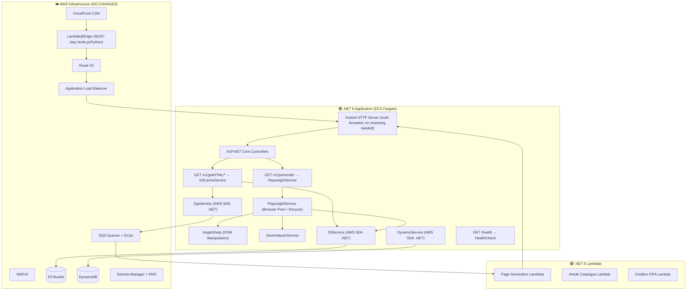

# SEO Pre-Rendering: .NET Architecture Overview

## 1. Can It Be Done?

**Yes, absolutely.** The entire architecture can be replicated in .NET. The AWS infrastructure (CloudFront, S3, SQS, DynamoDB, ECS Fargate, Lambda@Edge, Route 53, ALB) is **cloud-provider level** and remains completely unchanged — it's language-agnostic. The migration is purely at the **application code layer**.

---

## 2. The Puppeteer Question

### Does Puppeteer work in .NET?

**No.** Puppeteer is a Node.js-specific library. It does **not** have an official .NET port. However, there are mature, production-ready alternatives:

| Library | Type | Recommendation |
|:--------|:-----|:---------------|
| **Playwright for .NET** (`Microsoft.Playwright`) | ✅ **Best choice** | Microsoft-maintained, first-class .NET support, same Chromium engine, identical capabilities to Puppeteer |
| **PuppeteerSharp** (`PuppeteerSharp`) | ⚠️ Good alternative | Community-maintained .NET port of Puppeteer API. Same Chrome DevTools Protocol, very similar API surface |
| **Selenium WebDriver** | ❌ Avoid | Heavier, slower, designed for testing not headless rendering |

> [!IMPORTANT]
> **Playwright for .NET** (`Microsoft.Playwright`) is the recommended replacement. It is maintained by Microsoft, has identical headless Chromium capabilities, and supports all the features your current Puppeteer service uses: request interception, page navigation, DOM manipulation, smooth scrolling, and CSS extraction.

### Feature Parity Comparison

| Current Puppeteer Feature | Playwright .NET Equivalent |
|:--------------------------|:---------------------------|
| `puppeteer.launch({ headless: true })` | `playwright.Chromium.LaunchAsync(new() { Headless = true })` |
| `page.setRequestInterception(true)` — block analytics | `page.Route("**/*", handler)` — same request interception |
| `page.goto(url)` | `page.GotoAsync(url)` |
| `page.evaluate(() => ...)` — extract CSS-in-JS | `page.EvaluateAsync<T>("() => ...")` — identical |
| `page.click('.onetrust-accept')` — dismiss consent | `page.ClickAsync(".onetrust-accept")` — identical |
| Browser pool + recycle after N requests | Same pattern, you manage browser lifecycle manually |
| `page.content()` — get rendered HTML | `page.ContentAsync()` — identical |

---

## 3. Architecture Mapping: Node.js → .NET

### Current Stack vs .NET Stack

```
┌──────────────────────────────┬────────────────────────────────────────┐
│     CURRENT (Node.js)        │          .NET EQUIVALENT               │
├──────────────────────────────┼────────────────────────────────────────┤
│ NestJS 11 (Web Framework)    │ ASP.NET Core 8 (Web API)              │
│ Express (HTTP Server)        │ Kestrel (Built-in HTTP Server)        │
│ Puppeteer (Headless Chrome)  │ Playwright .NET / PuppeteerSharp      │
│ Cheerio (HTML Parsing/DOM)   │ AngleSharp or HtmlAgilityPack         │
│ AWS SDK v3 (JS)              │ AWSSDK for .NET (AWSSDK.*)            │
│ class-transformer (DTO)      │ System.Text.Json / AutoMapper         │
│ axios (HTTP Client)          │ HttpClient (built-in)                 │
│ cluster.fork() (Multi-core)  │ Kestrel (natively multi-threaded)     │
│ rxjs (Reactive streams)      │ System.Reactive / async-await/Tasks   │
│ Jest (Testing)               │ xUnit / NUnit + Moq                   │
│ TypeScript                   │ C#                                    │
│ npm / package.json           │ NuGet / .csproj                       │
│ Dockerfile (node:22-alpine)  │ Dockerfile (mcr.microsoft.com/       │
│                              │   dotnet/aspnet:8.0-alpine)           │
└──────────────────────────────┴────────────────────────────────────────┘
```

---

## 4. Component-by-Component Architecture in .NET

### 4.1 Web API Layer (replaces NestJS)

```
Current:   NestJS Controllers + Modules + Dependency Injection
.NET:      ASP.NET Core Minimal APIs or Controllers + Built-in DI
```

| NestJS Concept | ASP.NET Core Equivalent |
|:---------------|:------------------------|
| `@Module()` | `Program.cs` service registration / separate extension methods |
| `@Controller()` | `[ApiController]` classes or Minimal API `MapGet/MapPost` |
| `@Injectable()` services | Services registered via `builder.Services.AddScoped/Singleton/Transient` |
| `@Get('/v1/getHTML/*')` | `[HttpGet("v1/getHTML/{**path}")]` or `app.MapGet("v1/getHTML/{**path}", ...)` |
| Guards / Middleware | ASP.NET Middleware + Authorization Filters |
| Exception Filters | `IExceptionHandler` or Exception Middleware |
| Module-level HttpModule | `builder.Services.AddHttpClient()` (typed HTTP clients) |
| Strategy Pattern (DI inject array) | `IEnumerable<IArticleQueryStrategy>` injected via DI |

> [!TIP]
> **You DON'T need multi-core clustering in .NET.** Unlike Node.js (single-threaded event loop requiring `cluster.fork()`), ASP.NET Core's Kestrel server is **natively multi-threaded**. It automatically uses all available CPU cores via the .NET thread pool. This eliminates the entire clustering logic in [main.ts](file:///Users/lakshmi.sanikommu/Desktop/DAZN/seo-pre-rendering/src/main.ts#L67-L106).

### 4.2 Browser Rendering Service (replaces PuppeteerService)

The [PuppeteerService](file:///Users/lakshmi.sanikommu/Desktop/DAZN/seo-pre-rendering/src/seo-pre-render/services/puppeteer.service.ts) maps almost 1:1 to a `PlaywrightService` in .NET:

```
Current Architecture:
  PuppeteerService
    ├── Browser Pool (single browser, recycled every 1000 requests)
    ├── Connection error detection + auto-restart
    ├── process.exit(1) on unrecoverable failure → ECS replaces task
    ├── ExtractHTML() → navigate, scroll, intercept, extract CSS
    └── SEO Analyzer → validate titles, canonicals, H1s

.NET Architecture:
  PlaywrightService : IHostedService, IDisposable
    ├── Browser Pool (same pattern, IPlaywright + IBrowser lifecycle)
    ├── Connection error detection + auto-restart
    ├── Environment.Exit(1) on unrecoverable failure → ECS replaces task
    ├── ExtractHtmlAsync() → same flow using Playwright API
    └── SeoAnalyzerService → same validation logic
```

### 4.3 HTML Parsing & DOM Manipulation (replaces Cheerio)

| Current (Cheerio) | .NET Equivalent |
|:-------------------|:----------------|
| `cheerio.load(html)` | `new HtmlParser().ParseDocument(html)` (AngleSharp) |
| `$('link[rel=canonical]')` | `document.QuerySelector("link[rel=canonical]")` |
| `$.html()` | `document.ToHtml()` |
| jQuery-like CSS selectors | Full CSS selector support in AngleSharp |

**AngleSharp** is the recommended choice — it provides a full W3C-compliant DOM with CSS selectors, very similar to Cheerio's API.

### 4.4 AWS SDK Integration

| AWS Service | Node.js Package | .NET NuGet Package |
|:------------|:----------------|:-------------------|
| S3 | `@aws-sdk/client-s3` | `AWSSDK.S3` |
| SQS | `aws-sdk` (v2) / `@aws-sdk/client-sqs` | `AWSSDK.SQS` |
| DynamoDB | `@aws-sdk/client-dynamodb` + `@aws-sdk/lib-dynamodb` | `AWSSDK.DynamoDBv2` |
| Secrets Manager | `@aws-sdk/client-secrets-manager` | `AWSSDK.SecretsManager` |
| KMS | `@aws-sdk/client-kms` | `AWSSDK.KeyManagementService` |

> [!NOTE]
> The AWS SDK for .NET has **full feature parity** with the JavaScript SDK. IAM roles, OIDC federation, regional endpoints — all work identically.

### 4.5 Lambda Functions

| Current | .NET Equivalent |
|:--------|:----------------|
| Node.js 20.x Lambda runtime | `.NET 8` managed Lambda runtime |
| `handler: index.handler` | `Assembly::Namespace.Function::FunctionHandler` |
| TypeScript → JS compilation → ZIP | C# → `dotnet publish` → ZIP or container image |
| `@aws-sdk/*` in Lambda | `Amazon.Lambda.*` NuGet packages |

> [!WARNING]
> **Lambda@Edge has limited .NET support.** Lambda@Edge only supports **Node.js and Python** runtimes. Your origin-request Lambdas (`binge-origin-request`, `kayo-origin-request`) **must remain in Node.js/Python** — they cannot be ported to .NET. This is an AWS platform limitation, not a code limitation. Alternatively, you could migrate to **CloudFront Functions** (JavaScript only) for simple header manipulation.

---

## 5. High-Level .NET Architecture Diagram



---

## 6. What CANNOT Change (AWS Platform Constraints)

| Component | Reason |
|:----------|:-------|
| **Lambda@Edge** | Only supports Node.js and Python. The origin-request functions **must stay as-is**. |
| **CloudFront, S3, SQS, DynamoDB, ALB, Route 53** | Infrastructure layer — completely language-agnostic. Terraform configs stay the same. |
| **Terraform IaC** | Only needs updates to ECS task definition (new Docker image) and Lambda runtime (`dotnet8`). |
| **Docker Base Image** | Changes from `node:22-alpine` to `mcr.microsoft.com/dotnet/aspnet:8.0-alpine` + Chromium |

---

## 7. Key .NET NuGet Packages Needed

```xml
<!-- Web Framework -->
<PackageReference Include="Microsoft.AspNetCore.App" />

<!-- Headless Browser (choose one) -->
<PackageReference Include="Microsoft.Playwright" Version="1.*" />
<!-- OR -->
<PackageReference Include="PuppeteerSharp" Version="20.*" />

<!-- HTML Parsing (replaces Cheerio) -->
<PackageReference Include="AngleSharp" Version="1.*" />

<!-- AWS SDK -->
<PackageReference Include="AWSSDK.S3" Version="3.*" />
<PackageReference Include="AWSSDK.SQS" Version="3.*" />
<PackageReference Include="AWSSDK.DynamoDBv2" Version="3.*" />
<PackageReference Include="AWSSDK.SecretsManager" Version="3.*" />
<PackageReference Include="AWSSDK.KeyManagementService" Version="3.*" />

<!-- Health Checks -->
<PackageReference Include="AspNetCore.HealthChecks.Aws.S3" Version="8.*" />

<!-- Logging -->
<PackageReference Include="Serilog.AspNetCore" Version="8.*" />

<!-- Testing -->
<PackageReference Include="xunit" Version="2.*" />
<PackageReference Include="Moq" Version="4.*" />
```

---

## 8. Project Structure (.NET Convention)

```
seo-pre-rendering-dotnet/
├── src/
│   ├── SeoPreRendering.Api/                    # ASP.NET Core Web API
│   │   ├── Program.cs                          # Entry point (replaces main.ts)
│   │   ├── Controllers/
│   │   │   └── SeoPrerenderController.cs       # API endpoints
│   │   ├── Services/
│   │   │   ├── PlaywrightService.cs            # Browser pool (replaces PuppeteerService)
│   │   │   ├── S3CacheService.cs               # S3 read/write
│   │   │   ├── SqsService.cs                   # SQS publishing
│   │   │   ├── DynamoService.cs                # DynamoDB access
│   │   │   ├── SeoAnalyzerService.cs           # SEO audit
│   │   │   ├── HtmlExtractionService.cs        # DOM manipulation (AngleSharp)
│   │   │   └── ExternalApiService.cs           # HTTP client
│   │   ├── Strategies/                         # Article query strategies
│   │   │   ├── IArticleQueryStrategy.cs
│   │   │   ├── MovieByAssetStrategy.cs
│   │   │   └── ...
│   │   ├── Middleware/
│   │   │   └── RequestMetricsMiddleware.cs
│   │   ├── Filters/
│   │   │   └── GlobalExceptionFilter.cs
│   │   ├── Configuration/
│   │   │   └── EnvConfig.cs
│   │   ├── Dockerfile
│   │   └── SeoPreRendering.Api.csproj
│   │
│   ├── SeoPreRendering.PageGenLambda/          # Page generation Lambda
│   ├── SeoPreRendering.ArticleCatalogueLambda/ # Article catalogue Lambda
│   └── SeoPreRendering.OneBoxFifaLambda/       # OneBox FIFA Lambda
│
├── test/
│   └── SeoPreRendering.Api.Tests/
│
├── terraform/                                  # Stays mostly the same
│   └── ...                                     # Update ECS image + Lambda runtime
│
├── SeoPreRendering.sln                         # Solution file
└── .github/workflows/                          # Update build steps
```

---

## 9. What's BETTER in .NET

| Aspect | Node.js (Current) | .NET |
|:-------|:-------------------|:-----|
| **Multi-threading** | Single-threaded event loop, needs `cluster.fork()` hack | Natively multi-threaded via Kestrel thread pool |
| **Memory Management** | V8 GC + manual `--max-old-space-size`, Chromium memory leaks crash process | CLR garbage collector is more predictable; better memory pressure handling |
| **Type Safety** | TypeScript (compile-time only, runtime is JS) | C# (compile-time + runtime type safety) |
| **Performance** | V8 JIT | .NET 8 has superior throughput for CPU-bound server workloads |
| **Dependency Injection** | NestJS DI (runtime decorators, reflection) | Built-in first-class DI container |

## 10. What's HARDER in .NET

| Aspect | Challenge |
|:-------|:---------|
| **Lambda@Edge** | Cannot be ported — must remain Node.js or Python |
| **Cold Start** | .NET Lambda cold starts are historically slower than Node.js (~1-3s vs ~200-500ms). Mitigated with **Provisioned Concurrency** or Native AOT |
| **Chromium in Container** | Need to install Chromium in the .NET Alpine image (same `apk add chromium` approach works) |
| **Ecosystem Libraries** | DAZN-specific packages (`@dazn/dazl`, `@dazn/tacos-nestjs`, `@dazn/dazn-jwt-auth`) have **no .NET equivalents** — these need custom reimplementation |
| **Team Skill Set** | If the team is Node.js-first, there's a learning curve for C# / ASP.NET Core patterns |

---

## 11. Summary Decision Matrix

```
┌─────────────────────────┬──────────────────────────────────────────┐
│  Question               │  Answer                                  │
├─────────────────────────┼──────────────────────────────────────────┤
│ Can Puppeteer run in    │ NO — use Playwright .NET or              │
│ .NET?                   │ PuppeteerSharp instead                   │
├─────────────────────────┼──────────────────────────────────────────┤
│ Is the architecture     │ YES — same layered architecture,         │
│ portable?               │ same AWS services, same flows            │
├─────────────────────────┼──────────────────────────────────────────┤
│ What stays the same?    │ ALL AWS infrastructure, Terraform,       │
│                         │ CloudFront, S3, SQS, DynamoDB, ALB,     │
│                         │ Route 53, Lambda@Edge (stays Node.js)   │
├─────────────────────────┼──────────────────────────────────────────┤
│ What changes?           │ Application code (NestJS → ASP.NET),    │
│                         │ Docker image, Page Generation Lambdas,  │
│                         │ CI/CD build steps                        │
├─────────────────────────┼──────────────────────────────────────────┤
│ Biggest risk?           │ DAZN internal packages (@dazn/dazl,     │
│                         │ tacos-nestjs) need reimplementation      │
├─────────────────────────┼──────────────────────────────────────────┤
│ Recommended headless    │ Microsoft.Playwright (best)              │
│ browser library?        │ PuppeteerSharp (good alternative)        │
└─────────────────────────┴──────────────────────────────────────────┘
```
