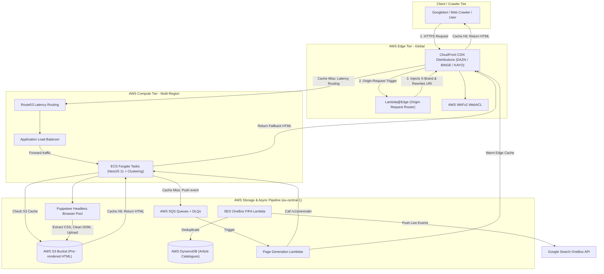

# SEO Pre-Rendering Platform: Architecture & Interview Guide

This document provides a comprehensive, end-to-end breakdown of the `seo-pre-rendering` service. It is designed to help you explain the system architecture, infrastructure, CI/CD pipelines, IAM security policies, and key engineering trade-offs in technical interviews.

---

## Table of Contents
1. [Executive Summary & Problem Statement](#1-executive-summary--problem-statement)
2. [High-Level Architecture Diagram](#2-high-level-architecture-diagram)
3. [End-to-End Request & Data Flows](#3-end-to-end-request--data-flows)
   - [Flow A: Fast Path — CloudFront Edge Cache Hit](#flow-a-fast-path--cloudfront-edge-cache-hit--50ms)
   - [Flow B: CloudFront Cache Miss & S3 Origin Fetch](#flow-b-cloudfront-cache-miss--s3-origin-fetch)
   - [Flow C: Asynchronous Pre-Rendering Worker Pipeline](#flow-c-asynchronous-pre-rendering-worker-pipeline)
   - [Flow D: CMS Ingestion & Google OneBox Integration](#flow-d-cms-ingestion--google-onebox-integration)
4. [AWS Infrastructure Architecture](#4-aws-infrastructure-architecture)
5. [Multi-Region Terraform Architecture (IaC)](#5-multi-region-terraform-architecture-iac)
6. [CI/CD Pipelines (GitHub Actions)](#6-cicd-pipelines-github-actions)
7. [IAM Roles & Security Architecture](#7-iam-roles--security-architecture)
8. [High-Value Interview Talking Points (Key Engineering Details)](#8-high-value-interview-talking-points-key-engineering-details)
9. [Anticipated Interview Q&A (Cheat Sheet)](#9-anticipated-interview-qa-cheat-sheet)

---

## 1. Executive Summary & Problem Statement

### The Problem
Modern streaming applications (such as **DAZN**, **BINGE**, and **KAYO Sports**) are Single-Page Applications (SPAs) built with rich client-side JavaScript frameworks (React, Emotion, Styled Components). 

While SPAs offer smooth client-side interactions, they present severe challenges for Search Engine Optimization (SEO):
1. **Crawler Execution Limits**: Search engine bots (Googlebot, Bingbot) have finite crawl budgets and often defer or fail JavaScript execution on heavy dynamic pages.
2. **Missing Metadata**: Social media link previews (OpenGraph, Twitter Cards) and schema.org / JSON-LD structured data must be present in the initial static HTML response.
3. **Geo-Specific Content**: Streaming catalogues vary drastically by region and country, requiring geo-aware server-side rendering for localized crawlers.

### The Solution
The **`seo-pre-rendering`** platform is a multi-tenant, multi-region reverse-proxy and asynchronous rendering system:
- **Sub-50ms Edge Responses**: Serves cached, fully hydrated HTML from CloudFront and S3.
- **Headless Browser Pool**: Uses an optimized, pooled headless Chromium (Puppeteer) engine inside AWS ECS Fargate to render dynamic JavaScript pages on demand.
- **Asynchronous Event-Driven Pipeline**: SQS and Lambda process cache misses and CMS content updates asynchronously without blocking user or crawler requests.
- **Multi-Brand Tenant Isolation**: Transparently routes requests across brands (`dazn`, `binge`, `kayo`) via Lambda@Edge.

---

## 2. High-Level Architecture Diagram

### Visual System Map (Text & ASCII Diagram)

```text
=============================================================================================================
                                          1. CLIENT / CRAWLER TIER
                          [ Googlebot / Bingbot / Social Crawlers / End Users ]
=============================================================================================================
                                                    │
                                                    │ HTTPS Request
                                                    ▼
=============================================================================================================
                                          2. AWS GLOBAL EDGE TIER
  ┌───────────────────────────────────────────────────────────────────────────────────────────────────────┐
  │ AWS CloudFront (CDN Distributions for DAZN / BINGE / KAYO) + AWS WAFv2                                │
  │ Cache-Control: s-maxage=43200 (12 Hours), Brotli/Gzip, stale-while-revalidate=300                     │
  └───────────────────────────────────────────────────────────────────────────────────────────────────────┘
            │                                                                           ▲
            │ [Origin Request Trigger]                                                  │ Warm Edge Cache
            ▼                                                                           │
  ┌──────────────────────────────────────┐                                              │
  │ Lambda@Edge (Origin Request Router)  │                                              │
  │ • Validates 'seo-cloudfront-verify'  │                                              │
  │ • Injects 'X-Brand: binge/kayo/dazn' │                                              │
  │ • Rewrites URI: '/v1/getHTML/*'      │                                              │
  └──────────────────────────────────────┘                                              │
========================================================================================│====================
                                 │                                                      │
                                 │ Cache Miss (Forward to Origin with custom header)    │
                                 ▼                                                      │
========================================================================================│====================
                           3. AWS MULTI-REGION COMPUTE TIER (ECS & ALB)                 │
                     Deployed in: eu-central-1, ap-northeast-1, ap-southeast-2,         │
                                  us-east-1, us-west-2, eu-south-2                      │
                                                                                        │
  ┌─────────────────────────────────────────────────────────────────────────────────┐   │
  │ AWS Route 53 (Latency-Based Routing + Health Checks on /health)                 │   │
  └─────────────────────────────────────────────────────────────────────────────────┘   │
            │                                                                           │
            ▼                                                                           │
  ┌─────────────────────────────────────────────────────────────────────────────────┐   │
  │ Application Load Balancer (ALB)                                                 │   │
  │ • Validates CloudFront shared secret header (Aborts with 403 Forbidden if absent)│   │
  │ • Balancing Algorithm: least_outstanding_requests                               │   │
  └─────────────────────────────────────────────────────────────────────────────────┘   │
            │                                                                           │
            ▼                                                                           │
  ┌─────────────────────────────────────────────────────────────────────────────────┐   │
  │ ECS Fargate Cluster (NestJS 11 Application)                                     │   │
  │ • Multi-Core Node.js Clustering (cluster.fork() per vCPU core)                  │   │
  │ • Keep-Alive Timeout = 65s, Headers Timeout = 66s (Prevents ALB 502 errors)     │   │
  │ • Route Handlers:                                                               │   │
  │     - GET /v1/getHTML/*  ──► Reads S3; enqueues to SQS on cache miss            │   │
  │     - GET /v1/prerender  ──► Invokes Puppeteer headless browser pool            │───┘
  └─────────────────────────────────────────────────────────────────────────────────┘
                                   │
         ┌─────────────────────────┴─────────────────────────┐
         │ (1. S3 Cache Check)                               │ (2. Cache Miss: Enqueue Task)
         ▼                                                   ▼
=======================================   ===================================================================
     4. STORAGE TIER (eu-central-1)               5. ASYNCHRONOUS WORKER & RENDERING PIPELINE (eu-central-1)
  ┌─────────────────────────────────┐       ┌─────────────────────────────────────────────────────────────┐
  │ Amazon S3 Bucket                │       │ Amazon SQS FIFO/Standard Queues (+ Dead Letter Queues)      │
  │ • Pre-rendered static HTML      │       │ • be_${env}_dazn_page_generator_queue                       │
  │ • Brand XML Sitemaps            │       │ • be_${env}_binge_page_generator_queue                      │
  └─────────────────────────────────┘       │ • be_${env}_kayo_page_generator_queue                       │
                    ▲                       └─────────────────────────────────────────────────────────────┘
                    │                                                      │
                    │ Upload HTML                                          │ SQS Event Trigger
                    │                                                      ▼
                    │                       ┌─────────────────────────────────────────────────────────────┐
                    │                       │ Page Generation Lambdas (Node.js 20.x)                      │
                    │                       │ • Batch size 1-10 with reserved concurrency limits          │
                    │                       │ • Calls regional ECS /v1/prerender endpoint                 │
                    │                       │ • Calls /v1/getHTML to warm CloudFront cache upon completion│
                    │                       └─────────────────────────────────────────────────────────────┘
                    │                                                      │
                    │                                                      ▼
                    │                       ┌─────────────────────────────────────────────────────────────┐
                    │                       │ Headless Browser Pool (Puppeteer inside ECS)                │
                    │                       │ • Auto-recycles browser instance every 1,000 requests       │
                    │                       │ • Injects geo IP via X-Forwarded-For (AU, GB, JP, etc.)     │
                    │                       │ • Blocks analytics & ads (GTM, New Relic, Google Analytics) │
                    │                       │ • Auto-dismisses OneTrust cookie consent banners            │
                    │                       │ • Smooth scrolls to hydrate lazy components & images        │
                    │                       │ • Inlines Emotion & Styled-Components CSS into static HTML  │
                    └───────────────────────│ • SEO Analyzer validates canonicals, titles, and H1s       │
                                            └─────────────────────────────────────────────────────────────┘
=============================================================================================================

=============================================================================================================
                               6. CMS INGESTION & GOOGLE ONEBOX PIPELINE
  ┌─────────────────────────┐          ┌──────────────────────────────────┐          ┌────────────────────┐
  │ CMS / ACC Streams       │ ───────► │ be_${env}_seo_article_catalogue  │ ───────► │ AWS DynamoDB       │
  │ (Show/Movie Updates)    │          │ SQS Queue & Lambda               │          │ Catalogue Tables   │
  └─────────────────────────┘          └──────────────────────────────────┘          └────────────────────┘
  ┌─────────────────────────┐          ┌──────────────────────────────────┐          ┌────────────────────┐
  │ Live Sports Fixtures    │ ───────► │ be_${env}_seo_onebox_fifa        │ ───────► │ Google Search      │
  │ (FIFA Tournaments, etc.)│          │ SQS Queue & Lambda (Secrets Mgr) │          │ OneBox Live Widget │
  └─────────────────────────┘          └──────────────────────────────────┘          └────────────────────┘
=============================================================================================================
```

---

### Mermaid Flowchart



---

## 3. End-to-End Request & Data Flows

### Flow A: Fast Path — CloudFront Edge Cache Hit (< 50ms)
1. A search crawler or user requests a URL (e.g., `https://kayosports.com.au/shows/show-name` or `https://binge.com.au/movies/movie-name`).
2. The request reaches the nearest **AWS CloudFront** edge location.
3. If CloudFront has the HTML cached in its edge cache:
   - CloudFront responds immediately with Brotli/Gzip-compressed HTML.
   - **Origin is never touched**, delivering sub-50ms latency.

---

### Flow B: CloudFront Cache Miss & S3 Origin Fetch
1. **Lambda@Edge Execution**:
   - Triggers on CloudFront `origin-request` event (`binge-origin-request` or `kayo-origin-request`).
   - Validates secret verification token (`seo-cloudfront-verify`). If invalid, aborts immediately with a `403 Forbidden`.
   - Injects tenant identification header: `X-Brand: binge` or `X-Brand: kayo`.
   - Rewrites URI from `/<path>` to `/v1/getHTML/<path>`.
2. **CloudFront to ALB**:
   - CloudFront forwards the request to the regional Application Load Balancer (**ALB**) resolved via Route 53 latency routing.
   - CloudFront injects a custom secret header (`var.alb_access_header_name: var.alb_access_header_value`).
3. **ALB Routing**:
   - The ALB evaluates listener rules. If the custom header is missing or incorrect, it returns a **403 Forbidden**, preventing anyone from bypassing CloudFront.
   - Forwards traffic using `least_outstanding_requests` balancing algorithm to the ECS Fargate container.
4. **ECS Service (NestJS `SeoPrerenderController`)**:
   - Handles `GET /v1/getHTML/*`.
   - Checks **AWS S3** bucket (`${aws_profile}-www-${env}-seo-router-pages-eu-central-1`) for the requested path.
   - **If found in S3**:
     - Strips cookie consent scripts, cleans query params from internal links, normalizes domains.
     - Adds response header `x-dazn-status: original` and `Cache-Control: s-maxage=43200, stale-while-revalidate=300` (12-hour CDN cache).
     - CloudFront caches this response for subsequent crawler visits.
   - **If NOT found in S3 (Cache Miss / Fallback)**:
     - NestJS publishes a message into **AWS SQS** (`be_${env}_${brand}_page_generator_queue`).
     - Returns a fallback or default template (`x-dazn-status: default`) so crawlers do not encounter timeouts.

---

### Flow C: Asynchronous Pre-Rendering Worker Pipeline
1. SQS triggers the **Page Generation Lambda** (`dazn-page-generation-lambda`, `binge-page-generation-lambda`, or `kayo-page-generation-lambda`).
2. Lambda invokes the protected regional rendering endpoint on ECS: `GET /v1/prerender?uri=<url>`.
3. In ECS, **`PuppeteerService`** executes:
   - Acquires a headless browser instance from its internal managed browser pool.
   - Injects country-specific proxy IP (`X-Forwarded-For`) so geo-restricted catalogues render properly.
   - **Ad & Analytics Interception**: Aborts requests to tracking scripts (`googletagmanager`, `google-analytics`, `newrelic`, `nr-data`) to prevent bot visits from corrupting business metrics and to accelerate rendering.
   - Automatically clicks and dismisses OneTrust cookie consent banners.
   - **Smooth Scrolling (`slowScrollToBottom`)**: Scrolls through the page to force lazy-loaded hero banners, carousels, and image tiers to hydrate.
   - **CSS-in-JS Extraction**: Inlines Emotion (`[data-emotion="css"]`) and Styled-Components (`[data-styled="active"]`) directly into the HTML to prevent Flash of Unstyled Content (FOUC).
   - **DOM Cleansing via Cheerio**: Injects hreflang canonical links, cleans query strings from internal links, removes OneTrust wrappers.
   - **SEO Analyzer**: Runs an automated audit checking title tags, canonicals, H1s, and robots meta tags; logs a markdown report for observability.
   - **S3 Upload**: Uploads the pre-rendered HTML file directly into the S3 bucket.
4. After rendering, the Lambda triggers a synthetic call to `/v1/getHTML` to **warm the CloudFront edge cache**.
5. If rendering fails, the message is re-queued with an exponential 15-minute delay (up to 3 retries), before being sent to the Dead Letter Queue (DLQ).

---

### Flow D: CMS Ingestion & Google OneBox Integration
1. **CMS Catalogue Sync**: When editorial teams add or update movies, shows, or sports fixtures in the CMS, events flow through ACC (Asset Catalogue Component) streams into `seo_article_catalogue_queue`.
2. **`seo-article-catalogue-lambda`**:
   - Parses show/fixture data.
   - Upserts catalogue records into **DynamoDB** (`be_${env}_seo_prerender_binge_article_catalogue`, `be_${env}_seo_prerender_kayo_article_catalogue`).
   - Updates sitemap XML files on S3.
   - Pushes new URLs to the pre-rendering SQS queue to pre-generate pages ahead of search engine visits.
3. **Google OneBox (`seo-onebox-fifa-lambda`)**:
   - Listens to `seo_onebox_fifa_queue` for live sports events (e.g. FIFA tournament games).
   - Calls DAZN Event API to fetch live match details and contestants.
   - Uses `google-auth-library` with Google Cloud Service Account keys stored in **AWS Secrets Manager** (decrypted via AWS KMS).
   - Posts structured LiveStream/Game Actions metadata directly to Google Search APIs so matches show real-time scores and streaming deep links directly inside the Google Search OneBox widget.
   - Uses DynamoDB table `be_${env}_seo_onebox_deduplicate` to guarantee idempotent publishing.

---

## 4. AWS Infrastructure Architecture

| AWS Service | Resource / Role in Architecture |
| :--- | :--- |
| **CloudFront** | Global edge distribution per brand (`seo_pre_cloudfront`, `binge_cloudfront`, `kayo_cloudfront`), 12-hour default TTL, Brotli/Gzip compression, TLS 1.2+ SNI with ACM certificates in `us-east-1`. |
| **Lambda@Edge** | Attached to CloudFront `origin-request` event. Verifies tokens, injects `X-Brand`, rewrites URIs before reaching origin. |
| **Route 53** | Latency-based routing (`latency_routing_policy`) directing requests to the lowest-latency regional ALB, backed by Route 53 HTTPS health checks on `/health`. |
| **ALB (Application Load Balancer)** | Multi-region ALBs in public subnets with `least_outstanding_requests` balancing. Validates secret header from CloudFront, returning 403 on direct access. |
| **ECS on AWS Fargate** | Multi-region compute clusters in private VPC subnets. Runs the containerized NestJS 11 application with CPU-based auto-scaling and connection timeouts tuned to eliminate 502 Bad Gateways. |
| **Amazon S3** | Central storage bucket (`${profile}-www-${env}-seo-router-pages-eu-central-1`) storing pre-rendered static HTML and sitemaps. |
| **Amazon DynamoDB** | `PAY_PER_REQUEST` on-demand billing, Point-in-time recovery (PITR), Streams enabled, TTL expiration on `expireAt` for catalogue and deduplication tables. |
| **Amazon SQS & DLQ** | Asynchronous decoupled queues for page generation, article ingestion, and Google Onebox, with 15-minute visibility timeouts, 5-day retention, and dead-letter queues (`maxReceiveCount = 5`). |
| **AWS Secrets Manager & KMS** | Storing Google service account credentials and API keys across regions with KMS multi-region keys. |
| **Amazon ECR** | Container image registry storing multi-architecture Docker images (`linux/arm64`). |
| **Coralogix & CloudWatch** | Centralized logging and alerting with Coralogix Lambda layer extensions, PagerDuty incident integration, and CloudWatch log groups. |

---

## 5. Multi-Region Terraform Architecture (IaC)

The repository organizes Terraform into a **Hub-and-Spoke / Regional Isolation pattern**:

```
terraform/
├── global/            # ECR Registries, baseline global IAM
├── service-global/     # Cross-region IAM task roles and global permissions
└── service/            # Regional & centralized resources
    ├── alb.tf          # Multi-region ALBs
    ├── ecs.tf          # Multi-region ECS Fargate services
    ├── route53.tf      # Route53 Latency & DNS records
    ├── cloudfront.tf   # Central CloudFront distributions (eu-central-1)
    ├── dynamo.tf       # Central DynamoDB tables (eu-central-1)
    ├── s3.tf           # Central S3 bucket (eu-central-1)
    ├── sqs.tf          # Central SQS queues & DLQs (eu-central-1)
    ├── lambda.tf        # Central worker Lambdas (eu-central-1)
    ├── iam.tf          # Service IAM policies
    └── iam-edge.tf     # Lambda@Edge trust roles
```

### The Multi-Region Deployment Strategy
In `sqs.tf`, `dynamo.tf`, `s3.tf`, `cloudfront.tf`, `lambda.tf`:
```hcl
count = var.aws_region == "eu-central-1" ? 1 : 0
```
- **Centralized Hub (`eu-central-1` / Frankfurt)**: All stateful and asynchronous resources (DynamoDB tables, S3 bucket, SQS queues, Lambdas, CloudFront configurations) are provisioned once in `eu-central-1`.
- **Distributed Spoke Regions**: The compute layer (ALB, ECS Fargate Service, Route 53 latency records) is deployed across **6 AWS regions** in production:
  1. `eu-central-1` (Europe - Frankfurt)
  2. `ap-northeast-1` (Asia - Tokyo)
  3. `ap-southeast-2` (Asia Pacific - Sydney)
  4. `us-east-1` (US East - N. Virginia)
  5. `us-west-2` (US West - Oregon)
  6. `eu-south-2` (Europe - Spain)
- **Why this design?**
  Crawlers and users worldwide hit the closest regional ECS instance via Route 53 latency routing, while maintaining a single, consistent S3/DynamoDB storage backbone without cross-region replication race conditions.

---

## 6. CI/CD Pipelines (GitHub Actions)

The deployment pipeline is fully automated using GitHub Actions (`.github/workflows/ci.yml` and `cd.yml`):

### Continuous Integration (`ci.yml`)
1. **Pre-flight & Linting**:
   - Runs `npm ci` using internal private JFrog Artifactory tokens.
   - Runs `tflint` for Terraform static analysis and ESLint for code formatting.
2. **Dynamic Deployment Matrix**:
   - Executes `.github/scripts/setup-deploy-matrix.js`.
   - Reads environment configs (`dev.config.json`, `stage.config.json`, `prod.config.json`) and outputs a parallel matrix combining all modules, environments, and AWS regions.
3. **Terraform Plan Matrix**:
   - Assumes AWS IAM Roles securely via **AWS OIDC Web Identity Federation** (no long-lived AWS keys stored in GitHub).
   - Generates and validates `terraform plan` for all 6 regions in parallel.
4. **Multi-Arch Docker Build & Push**:
   - Runs on native ARM64 self-hosted spot runners (`nim-linux-docker-arm64-spot`).
   - Builds optimized container images for `linux/arm64` architecture (higher performance and 20% lower cost on AWS Graviton Fargate).
   - Tags image with git short SHA (`${GITHUB_SHA:0:10}`) and branch prefix, then pushes to Amazon ECR.
5. **Lambda Artifact Packaging**:
   - Compiles each TypeScript lambda (`dazn-page-generation`, `binge-page-generation`, `kayo-page-generation`, `seo-article-catalogue`, `seo-onebox-fifa`).
   - Packages ZIP archives and uploads them to S3 artifact storage (`s3_key_dazn`, `s3_key_binge`, etc.).

### Continuous Deployment (`cd.yml`)
- Triggered via `workflow_dispatch` with an environment input (`dev`, `stage`, `prod`).
- Uses GitHub Environments with protection rules and approval gates.
- Executes `terraform apply` across all regional matrix targets in parallel, safely rolling out new ECS task definitions and updating Lambdas.

---

## 7. IAM Roles & Security Architecture

Security is implemented following the **Principle of Least Privilege**:

1. **ECS Task Role (`global_task_role`)**:
   - `dynamodb:*` restricted strictly to catalogue and SEO mapping tables.
   - `s3:GetObject`, `s3:PutObject` restricted to the SEO router S3 bucket.
   - `sqs:*` restricted to publishing and consuming page generation queues.
   - CloudWatch and Coralogix logging permissions.
2. **Lambda Worker Roles (`generator-lambda-role`, `seo_article_catalogue-lambda-role`)**:
   - Can only read from and delete messages in their assigned SQS queues.
   - Network interface management (`ec2:CreateNetworkInterface`, etc.) to run within private subnets.
3. **Edge Lambda Role (`edge_lambda`)**:
   - Assumed by both `lambda.amazonaws.com` and `edgelambda.amazonaws.com`.
   - Replicated globally across AWS CloudFront edge locations, restricted strictly to CloudWatch log streaming.
4. **Google OneBox Role (`seo_onebox_fifa-lambda-role`)**:
   - `secretsmanager:GetSecretValue` scoped to Google credentials secrets.
   - `kms:Decrypt` scoped to the specific Multi-Region Key (MRK) ID.
   - `dynamodb:PutItem`/`GetItem` restricted to `be_${env}_seo_onebox_deduplicate`.
5. **Cross-Account Trust Policies**:
   - SQS queue policies explicitly whitelist CMS publisher lambdas from other DAZN AWS accounts (`arn:aws:iam::240680620468:...` and `arn:aws:iam::480309102926:...`).

---

## 8. High-Value Interview Talking Points (Key Engineering Details)

Mentioning these specific production-grade engineering details demonstrates deep architectural and operational expertise:

1. **Eliminating ALB 502 Bad Gateway Errors (Node.js Keep-Alive Bug)**:
   - In `src/main.ts`:
     ```typescript
     server.keepAliveTimeout = 65000;
     server.headersTimeout = 66000;
     ```
   - *Explanation*: The ALB idle timeout is 60 seconds. By setting Node’s keep-alive timeout higher (65s) and header timeout higher still (66s), you ensure the ALB closes idle connections first, preventing race-condition 502 errors where Node closes a socket just as ALB routes a new request.
2. **Multi-Core Clustering on Fargate**:
   - Node.js is single-threaded by default. In `src/main.ts`, the app inspects `process.env.USABLE_CORES` and uses Node’s native `cluster.fork()` to spawn worker processes per vCPU allocated to the Fargate task, maximizing CPU utilization.
3. **Browser Pool & Memory Leak Mitigation in Puppeteer**:
   - Headless Chrome is notorious for memory leaks. In `PuppeteerService`:
     - Browsers are pooled and automatically recycled after 1,000 requests (`RECYCLE_AFTER = 1000`).
     - Includes disconnection listeners and automated restart with retry backoff.
     - Crashed browsers automatically exit the process with code 1, allowing ECS Fargate health checks to instantly replace the task.
4. **CSS-in-JS Inlining for Modern SPAs**:
   - SPAs using Emotion or Styled Components inject styles into `<style>` tags at runtime via JavaScript. Search crawlers often parse the HTML before JS execution completes.
   - `ExtractHTML` extracts rules from `document.querySelectorAll('[data-emotion="css"]')` and inlines them directly into the static HTML string so crawlers see fully rendered styles immediately.
5. **Bot Analytics Shielding**:
   - During Puppeteer rendering, requests to `google-analytics`, `googletagmanager`, and `newrelic` are aborted at network level, preventing millions of crawler pre-render cycles from skewing business analytics.
6. **Defense-in-Depth Origin Protection**:
   - Direct IP/domain access to ALBs is prevented: ALB returns `403 Forbidden` unless the CloudFront custom shared secret header matches.
   - Lambda@Edge checks `seo-cloudfront-verify` before forwarding to origin.

---

## 9. Anticipated Interview Q&A (Cheat Sheet)

**Q: Why not use Next.js Server-Side Rendering (SSR) instead of Puppeteer pre-rendering?**
> *Answer:* "Migrating an entire legacy SPA suite across DAZN, Binge, and Kayo to SSR frameworks like Next.js requires massive rewrites of existing frontend codebases, state stores, and browser-only dependencies. This pre-rendering architecture decouples SEO from the application frontend—allowing product teams to keep building standard SPAs while this platform acts as a dedicated, cacheable reverse-proxy SEO layer."

**Q: How do you prevent cache thundering herds when a popular show goes live?**
> *Answer:* "Two layers: First, CloudFront uses `stale-while-revalidate=300`, serving slightly stale content while fetching an update in the background. Second, the SQS queues use 15-minute visibility delays, and the Page Generation Lambdas have reserved concurrency limits (`var.binge_reserved_concurrent_executions`) to prevent overwhelming the rendering engine."

**Q: How do you handle zero-downtime deployments across 6 regions?**
> *Answer:* "Terraform configures the ALB target groups with `create_before_destroy = true`. ECS Fargate uses rolling updates (`minimum_healthy_percent = 100`, `maximum_percent = 200`), spinning up new tasks and verifying Route 53 `/health` checks before draining old tasks. GitHub Actions runs these deployments across all regions in parallel."
